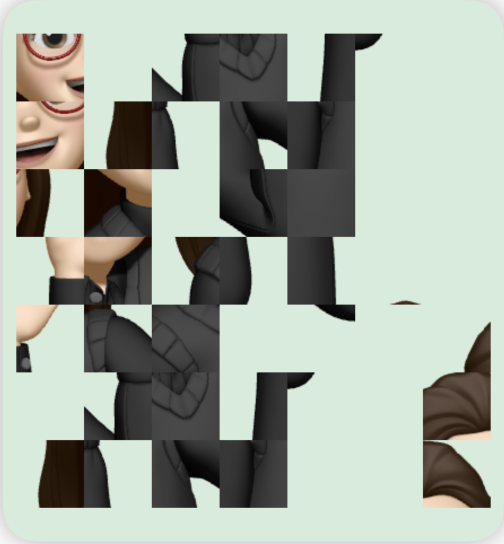

# 🔐 PixelShuffle
 
 
## Educational Image Encryption & Permutation Demo
PixelShuffle is a small iOS project that explores how an image can be visually scrambled by dividing it into smaller tiles and rearranging them using a deterministic mathematical transformation.
The project was created as a personal experiment to explore concepts related to cryptography, permutation, key-based transformations, and the difference between visual obfuscation and actual secure encryption.

## ⚠️ Educational Project — Not Cryptographically Secure
PixelShuffle is not intended to protect sensitive information or replace established cryptographic algorithms. The implementation is deliberately simple and is primarily intended for learning and experimentation.
📱 Demo
The application takes an image, divides it into a 7 × 7 grid, and rearranges the resulting tiles.

### Original

 

### Scrambled

The actual application displays the resulting image rather than tile numbers.
## 🧠 How It Works
#### The image is divided into 49 individual tiles:
🧠 How It Works
The image is divided into 49 individual tiles (7 × 7).
<table>
  <tr>
    <td align="center"><strong>Original Image</strong></td>
    <td align="center">→</td>
    <td align="center"><strong>7 × 7 Grid</strong></td>
    <td align="center">→</td>
    <td align="center"><strong>49 Tiles</strong></td>
    <td align="center">→</td>
    <td align="center"><strong>Permutation</strong></td>
    <td align="center">→</td>
    <td align="center"><strong>Scrambled Image</strong></td>
  </tr>
</table>

Each tile is assigned a new position using a deterministic transformation.
The basic transformation is:

#### index = (column × 5 + row + key) % N

#### Where:
row = current row
column = current column
key = numerical key
N = number of image tiles
For the current implementation:
N = 49

### 🔑 Is This Real Encryption?
No.
This project intentionally demonstrates the difference between scrambling and cryptographic encryption.
The image content itself is not cryptographically transformed. Instead, the positions of image blocks are rearranged.
This creates a visually scrambled image, but it does not provide the security properties expected from modern cryptography.

For real-world data protection, established algorithms such as AES-GCM should be used instead of a custom algorithm.

## 🔎 Security Analysis
The project is intentionally simple so that its limitations can be explored.
#### 1. Deterministic Transformation
The same input and key produce the same tile arrangement.
This makes the transformation predictable.

#### 2. Limited Transformation
Only the position of the tiles changes.
The pixels inside each tile remain unchanged.

An attacker may therefore still obtain information from individual blocks.

#### 3. No Authentication
The algorithm does not provide integrity or authenticity.
An attacker could potentially modify the scrambled data without the system detecting the modification.

#### 4. No Cryptographic Primitive
The algorithm is not based on a standardized cryptographic construction and has not undergone the extensive analysis expected of a real cryptographic algorithm.

#### 5. Known-Plaintext Analysis
If an attacker obtains both an original image and its scrambled version, the relationship between the original tile positions and scrambled positions can potentially be analyzed.
This makes the transformation unsuitable for protecting confidential information.

## 🎯 Why I Built This
This started as a personal experiment around a simple question:
Can an image look encrypted without actually being securely encrypted?
Building the application made it possible to explore the concept practically rather than only studying it theoretically.
The project also helped me experiment with:

- Image manipulation
- Permutation algorithms
- Key-based transformations
- Cryptographic limitations
- SwiftUI architecture
- UIKit image processing
- MVVM
- Security analysis

## 🏗️ Architecture
The project follows a simple MVVM structure.
<table>
  <tr>
    <th>Layer</th>
    <th>Responsibility</th>
  </tr>
  <tr>
    <td><strong>View</strong></td>
    <td>Displays the image grid, controls, and information.</td>
  </tr>
  <tr>
    <td><strong>ViewModel</strong></td>
    <td>Handles image processing, tile permutation, and application state.</td>
  </tr>
  <tr>
    <td><strong>Model</strong></td>
    <td>Stores the grid size, encryption key, and encryption state.</td>
  </tr>
</table>

The separation keeps the UI independent from the image-processing and permutation logic.

## 🛠️ Technologies
Swift
SwiftUI
UIKit
MVVM
iOS
Image Processing
Basic Cryptographic Concepts

## 🚀 Future Improvements
This project is intentionally small, but there are several directions it could be taken:
- Support different grid sizes
- Allow users to select their own images
- Visualize the tile permutation
- Add a key input
- Add a cryptanalysis mode
- Demonstrate a known-plaintext attack
- Compare tile scrambling with AES-GCM
- Add entropy measurements
- Add unit tests for permutation logic
- Add an interactive security analysis screen
  
## 📚 What This Project Demonstrates
Rather than attempting to create a new cryptographic algorithm, this project demonstrates an important security principle:
Something that looks encrypted is not necessarily secure.
Modern cryptography relies on carefully designed algorithms that have been extensively analyzed and tested.
A custom scrambling algorithm may be interesting as an educational experiment, but it should not be used as a replacement for established cryptographic primitives.

## ⚠️ Disclaimer
This software is provided for educational and experimental purposes only.
Do not use PixelShuffle or its permutation algorithm to protect passwords, personal information, confidential documents, or any other sensitive data.

For real-world cryptographic applications, use well-established and appropriately implemented cryptographic standards.

## 👩🏻‍💻 About
PixelShuffle is an independent personal project created to explore the intersection of software development and cybersecurity through a practical experiment.
The project focuses not only on building the application, but also on understanding why a seemingly encrypted result does not necessarily provide cryptographic security.
